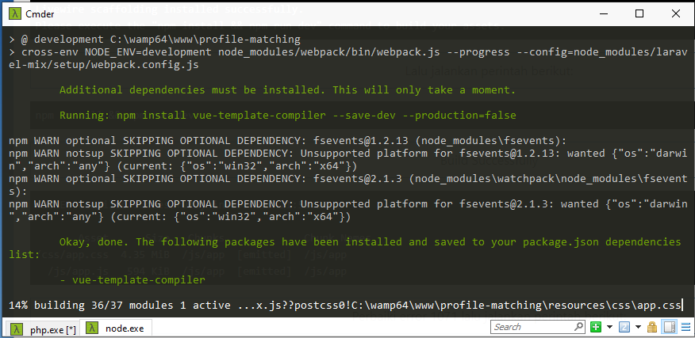

# <div style={{ textAlign: 'center' }}>Cara membuat Authentication Scaffolding di Laravel 8<br/> #login #logout #register</div>

<div class="container">
<p style={{ textAlign: 'center' }}>Install laravel/jetstream, setelah berhasil. install salah satunya Livewire atau Inertia</p>

```js
composer require laravel/jetstream
```

<p style={{ textAlign: 'center' }}>Pilih Inertia jika anda ingin menggunakan VueJS sebagai template anda !!!</p>

```
// Install Jetstream with the Livewire stack...
php artisan jetstream:install livewire

// Install Jetstream with the Inertia stack...
php artisan jetstream:install inertia
```

```plaintext title="Hasil install Livewire"
C:\wamp64\www\laravel8
λ php artisan jetstream:install livewire
Migration created successfully!
./composer.json has been updated
Loading composer repositories with package information
Updating dependencies (including require-dev)
Package operations: 2 installs, 0 updates, 0 removals
  - Installing laravel/sanctum (v2.6.0): Downloading (100%)
  - Installing livewire/livewire (v2.2.1): Downloading (100%)
Writing lock file
Generating optimized autoload files
> Illuminate\Foundation\ComposerScripts::postAutoloadDump
> @php artisan package:discover --ansi
Discovered Package: facade/ignition
Discovered Package: fideloper/proxy
Discovered Package: fruitcake/laravel-cors
Discovered Package: jenssegers/agent
Discovered Package: laravel/fortify
Discovered Package: laravel/jetstream
Discovered Package: laravel/sanctum
Discovered Package: laravel/tinker
Discovered Package: livewire/livewire
Discovered Package: nesbot/carbon
Discovered Package: nunomaduro/collision
Package manifest generated successfully.
Copied Directory [\vendor\laravel\sanctum\database\migrations] To [\database\migrations]
Copied File [\vendor\laravel\sanctum\config\sanctum.php] To [\config\sanctum.php]
Publishing complete.

Livewire scaffolding installed successfully.
Please execute the "npm install && npm run dev" command to build your assets.
```

```plaintext title="Hasil install Inertia"
C:\wamp64\www\my-alumni2
λ php artisan jetstream:install inertia
Migration created successfully!
./composer.json has been updated
Loading composer repositories with package information
Updating dependencies (including require-dev)
Package operations: 3 installs, 0 updates, 0 removals
  - Installing inertiajs/inertia-laravel (v0.3.6): Downloading (100%)
  - Installing laravel/sanctum (v2.9.0): Downloading (100%)
  - Installing tightenco/ziggy (v1.0.4): Downloading (100%)
Writing lock file
Generating optimized autoload files
> Illuminate\Foundation\ComposerScripts::postAutoloadDump
> @php artisan package:discover --ansi
Discovered Package: facade/ignition
Discovered Package: fideloper/proxy
Discovered Package: fruitcake/laravel-cors
Discovered Package: inertiajs/inertia-laravel
Discovered Package: jenssegers/agent
Discovered Package: laravel/fortify
Discovered Package: laravel/jetstream
Discovered Package: laravel/sail
Discovered Package: laravel/sanctum
Discovered Package: laravel/tinker
Discovered Package: nesbot/carbon
Discovered Package: nunomaduro/collision
Discovered Package: tightenco/ziggy
Package manifest generated successfully.
Copied Directory [\vendor\laravel\sanctum\database\migrations] To [\database\migrations]
Copied File [\vendor\laravel\sanctum\config\sanctum.php] To [\config\sanctum.php]
Publishing complete.
Middleware created successfully.

Inertia scaffolding installed successfully.
Please execute "npm install && npm run dev" to build your assets.
```

<p style={{ textAlign: 'center' }}>Update npm (Jalankan CMD sebagai Administrator terlebih dahulu)</p>

```
npm install -g npm

atau 

npm install npm@latest -g
```

<p style={{ textAlign: 'center' }}>Lalu jalankan perintah berikut:</p>

```
npm install && npm run dev
```

<p style={{ textAlign: 'center' }}>Build Successfully</p>

```
 DONE  Compiled successfully in 39770ms 21:52:23

       Asset      Size   Chunks             Chunk Names
/css/app.css  4.35 MiB  /js/app  [emitted]  /js/app
  /js/app.js   594 KiB  /js/app  [emitted]  /js/app
```

<p style={{ textAlign: 'center' }}>Perbaiki error 1071 lalu jalankan perintah berikut:</p>

```
php artisan migrate
```

<p style={{ textAlign: 'center' }}>Saya lihat ada tambahan dependency yang harus di install seperti pada gambar dibawah</p>
</div>

<div style={{ textAlign: 'center' }}>



</div>